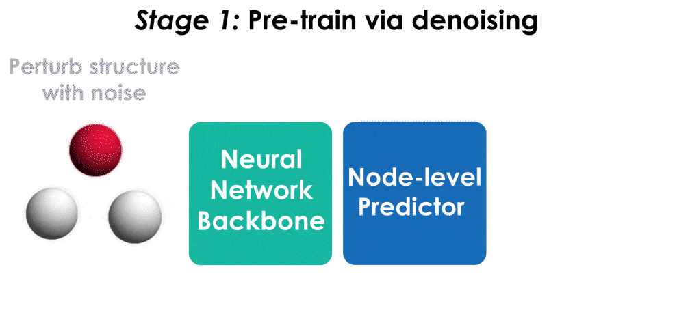

# Pre-training via Denoising for Molecular Property Prediction

Pre-training via denoising is a powerful representation learning technique for molecules. This repository contains the official implementation of pre-training for the TorchMD-NET architecture, built off the [original TorchMD-NET repository](https://github.com/torchmd/torchmd-net), based on the paper:

[Pre-training via Denoising for Molecular Property Prediction](https://arxiv.org/abs/2206.00133)

by [Sheheryar Zaidi*](https://shehzaidi.github.io/), [Michael Schaarschmidt*](https://www.michaelschaarschmidt.com/), [James Martens](http://www.cs.toronto.edu/~jmartens/), [Hyunjik Kim](https://hyunjik11.github.io/), [Yee Whye Teh](http://www.stats.ox.ac.uk/~teh/), [Alvaro Sanchez Gonzalez](https://scholar.google.co.uk/citations?user=d1oQ8NcAAAAJ&hl=en), [Peter Battaglia](https://scholar.google.com/citations?user=nQ7Ij30AAAAJ&hl=en), [Razvan Pascanu](https://sites.google.com/corp/view/razp), [Jonathan Godwin](https://scholar.google.co.uk/citations?user=TEYiFIsAAAAJ&hl=en&oi=sra).



## How to use this code

### Install dependencies

Clone the repository:
```
git clone https://github.com/shehzaidi/pre-training-via-denoising.git
cd pre-training-via-denoising
```

Create a virtual environment containing the dependencies and activate it:
```
conda env create -f environment.yml
conda activate pvd
```

Install the package into the environment:
```
pip install -e .
```
### Pre-training on PCQM4Mv2

The model is pre-trained on the [PCQM4Mv2]() dataset, which contains over 3 million molecular structures at equilibrium. Run the following command to pre-train the architecture first. Note that this will download and pre-process the PCQM4Mv2 dataset when run for the first time, which can take a couple of hours depending on the machine.

```
python scripts/train.py --conf examples/ET-PCQM4MV2.yaml --layernorm-on-vec whitened --job-id pretraining
```

The option `--layernorm-on-vec whitened` includes an optional equivariant whitening-based layer norm, which stabilizes denoising. The pre-trained model checkpoint will be in `./experiments/pretraining`.

### Fine-tuning on QM9

To fine-tune the model for HOMO/LUMO prediction on QM9, run the following command, specifying `homo`/`lumo` and the path to the pre-trained checkpoint:

```bash
python scripts/train.py --conf examples/ET-QM9-FT.yaml --layernorm-on-vec whitened --job-id finetuning --dataset-arg <homo/lumo> --pretrained-model <path to checkpoint>
```

The fine-tuned model achieves state-of-the-art results for HOMO/LUMO on QM9:

| **Target** | **Test MAE (meV)** |
|------------|:------------------:|
| HOMO       |        15.5        |
| LUMO       |        13.2        |


### Data Parallelism 

By default, the code will use all available GPUs to train the model. We used three GPUs for pre-training and two GPUs for fine-tuning (NVIDIA RTX 2080Ti), which can be set by prefixing the commands above with e.g. `CUDA_VISIBLE_DEVICES=0,1,2` to use three GPUs.

## Guide for implementing pre-training via denoising

It is straightforward to implement denoising in an existing codebase. There are broadly three steps:

1. Add noise to the input molecular structures in the dataset. See [here](https://github.com/shehzaidi/pre-training-via-denoising/blob/c545b76e0242d89e7f88a444c06e26cf7fd0d6c1/torchmdnet/data.py#L32).
2. Add an output module to the architecture for predicting the noise. See [here](https://github.com/shehzaidi/pre-training-via-denoising/blob/c545b76e0242d89e7f88a444c06e26cf7fd0d6c1/torchmdnet/models/model.py#L146).
3. Use (or augment an existing loss with) an L2 loss for training the model. See [here](https://github.com/shehzaidi/pre-training-via-denoising/blob/c545b76e0242d89e7f88a444c06e26cf7fd0d6c1/torchmdnet/module.py#L144).

## Citation

If you have found this work useful, please consider using the following citation:

```bib
@misc{zaidi2022pretraining,
      title={Pre-training via Denoising for Molecular Property Prediction}, 
      author={Sheheryar Zaidi and Michael Schaarschmidt and James Martens and Hyunjik Kim and Yee Whye Teh and Alvaro Sanchez-Gonzalez and Peter Battaglia and Razvan Pascanu and Jonathan Godwin},
      year={2022},
      eprint={2206.00133},
      archivePrefix={arXiv},
      primaryClass={cs.LG}
}
```
